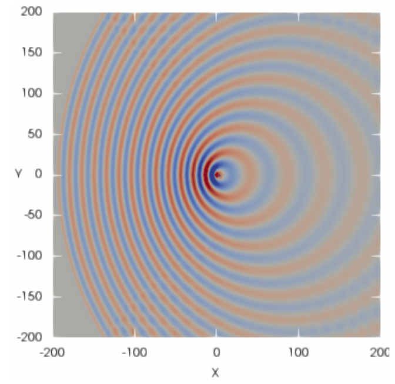
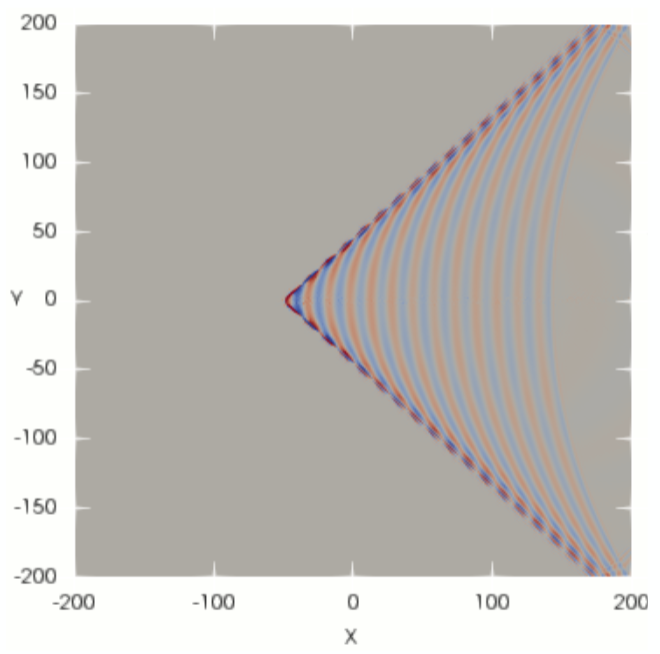
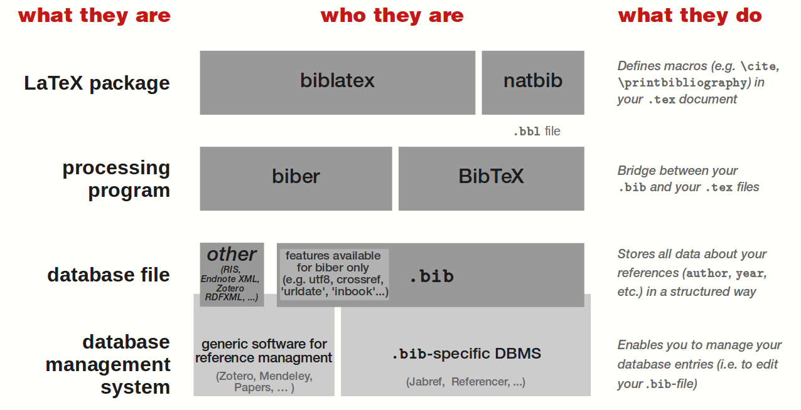

# LaTeX course : Beamer module
Module's sample files and figures:

## Goal:
To build a simple presentation that helps us become familiar with:

- S1 : Title page,
- S1 : Outline page,
- S1 : Frame with a figures,
- S1 : Frame with a tables,
- S1 : Frame with blocks,
- S1 : Frame with multiple columns,
- S1 : Frame with breaks,

- S2 : The Bibliography with biblatex, 
- S2 : Fotenotes and references,
- S2 : Handouts.

- S3 : Frame with a code,
- S3 : Frame with figures overlays,
- S3 : The metropolis theme,

## Starting hint:
```latex
% Set Beamer class
\documentclass{Beamer}

% Set theme and color scheme, see [1].
\usetheme{Warsaw}
\usecolortheme{wolverine}

% Load basic packages
\usepackage{lipsum}

% Set basica parameters
\title{My Presentation}
\subtitle{using Beamer class!}
\author{Manuel A. Diaz}
\institute{University of Poitiers}
\date{\today}

% Begin our document
\begin{document}

\begin{frame}
    \titlepage
\end{frame}

\begin{frame}{Outline}
    \tableofcontents
\end{frame}

%%%%%%%%%%%%%%%%%%%
\section{Section 1}
%%%%%%%%%%%%%%%%%%%

\subsection{Method 1}
\begin{frame}{Method 1}
    I tried this method, but didn't work.
\end{frame}

\subsection{Method 2}
\begin{frame}{Method 2}
    I tried this other method. It worked but don't known why!?
\end{frame}

%%%%%%%%%%%%%%%%%%%
\section{Section 2}
%%%%%%%%%%%%%%%%%%%
\begin{frame}{Some Results}
    This is what I got ...
\end{frame}

\end{document}
```
## Complementary material in `figures/` : 






## Complementary material in `templates/` :
Beamer templates with bibliography:
- [template01.tex](/templates/template_standardBib.tex) : a template with traditional bibliography footnotes.
- [template02.tex](/templates/template_hackedBid.tex) : a template with costum /cite function and built in bibliography.
- [template03.tex](/templates/template_fullHackedBid.tex) : a template with costum /cite function with bib-file.

## References
1. The Beamer theme matrix by [hartwork.org](https://hartwork.org/beamer-theme-matrix/),
2. The Beamer tutorial by [overleaf.com](https://www.overleaf.com/learn/latex/Beamer_Presentations%3A_A_Tutorial_for_Beginners_(Part_1)—Getting_Started),
3. The Markdown [cheat sheet](https://www.markdownguide.org/cheat-sheet/).
